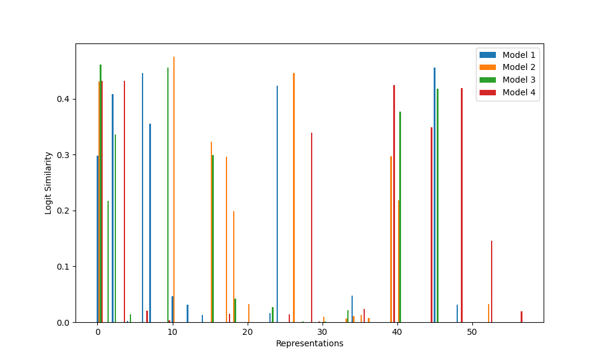
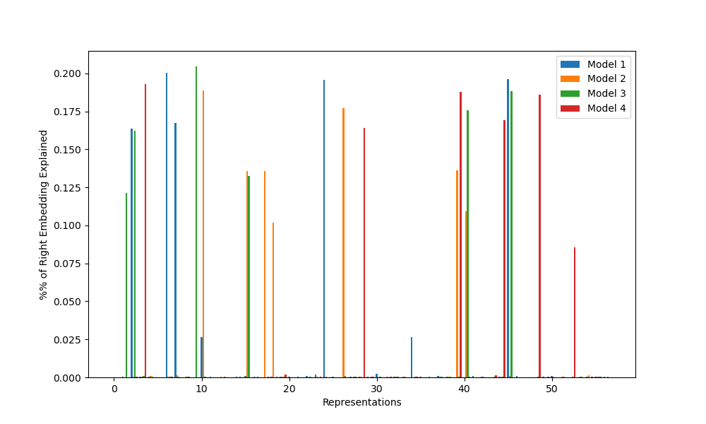
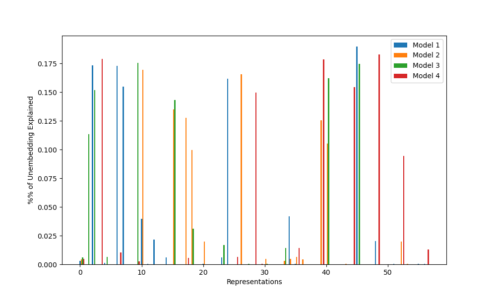

# Replicating Toy Models of Universality

For my March 2024 AI Safety Fundamentals project, I replicated Bilal Chughtai et al's paper [A Toy Model of Universality](https://arxiv.org/pdf/2302.03025). Due to time and skill constraints, I was only able to test the logit attributions (Section 5.1) and the embeddings and unembeddings (Section 5.2) using MLP models trained on the group C_113, but this was sufficient to confirm the overall thesis of the paper.

## Background

One of the largest fields of AI alignment research is mechanistic interpretability: the study of the internals of deep learning models. The hope of mechanistic interpretability is that, by understanding how those models work, we will be able to better determine when they are or aren’t aligned, or even deliberately steer them towards alignment.

Much of the tractability of this approach may rely on [universality](https://distill.pub/2020/circuits/zoom-in/#claim-3): the hypothesis that similar models will contain similar features. If universality holds, we’ll be able to understand a wide variety of models by studying just a few; if it doesn’t, we’ll have to start over from scratch every time. This hypothesis can be further divided into weak universality (models implement similar algorithms) and strong universality (models implement those algorithms in the same way).

Bilal Chughtai et al’s paper [A Toy Model of Universality](https://arxiv.org/pdf/2302.03025) tests both of these hypotheses by training one-layer models to do group composition (eg modular arithmetic). This turns out to have a relatively simple algorithm - in the embedding, the model can convert the inputs into equivalent matrices (eg turning modular arithmetic into rotation matrices); in the hidden layer, the model can multiply those matrices together; and in the unembedding, the model can compute the trace of the multiplication of that product and the inverse of every possible result. This trace is maximized when that last multiplication is the identity, or equivalently, when the product and the possible result are the same. The map between the group and the matrices is called a representation, so this algorithm is called the Group Composition via Representations (GCR) algorithm.

Notably, most groups have multiple representations. Consider the cyclic group of order 12, which is equivalent to modular arithmetic with a modulus of 12. The obvious representation for this group is to represent 1 as the rotation matrix for 1/12 of the circle, 2 as the rotation matrix for 2/12, and so on, as on a clock. However, another possible representation matrix is to represent 1 as a 5/12 rotation, skipping around the clock. These multiple representations make the problem of group composition a natural choice for assessing strong and weak universality - we can check to see if each model learns the GCR algorithm, *and* we can see if they learn the same representations.

Chughtai et al’s original paper found that models trained on a variety of groups consistently learned the GCR algorithm, but varied on which representations they learned. In this project, I replicate this result on the cyclic group of order 113, or equivalently, modular addition with modulus 113.

## Methods

For this project, I trained four one-layer multi-layer perceptron models. Each element of C_113 was represented as a one-hot vector, and two such vectors were passed as inputs to the model. Each of these vectors was then put through separate embedding layers of size 256 (the left and right embeddings respectively). The results were concatenated and then fed through an MLP layer using ReLU with 128 neurons. Finally, the outputs of the neurons were sent through an unembedding layer to give a logit for each element. None of the layers had biases. The models were trained using an independently randomly selected 40% of the element pairs, cross-entropy loss, and an AdamW optimizer. Hyperparameters can be found at the top of [the relevant code file](./mlp_mod_arithm.py).

The GCR algorithm predicts a particular calculation that results in the logits: the trace of a matrix product. Since this gives, for each representation, a specific prediction for the output vector, we can check the cosine similarity to see if this prediction holds. Given the high dimensionality of the space, high similarity values are unlikely to happen by coincidence, and indicate that the GCR algorithm is being implemented.

Furthermore, the GCR algorithm also predicts that the embedding and unembedding matrices will contain some way of calculating the elements of the rotation matrices for any representations used. Thus, we can flatten the list of matrices in a particular representation into a few vectors of length 113, then check to see how much of the variance of the embedding and unembedding matrices are explained by the resulting subspace. By a theorem in the appendix of the original paper, representation spaces are orthogonal, so a completely random embedding matrix should most likely have variance explained roughly equally by each representation. If the variance explained is concentrated into a few representations, this is another indication that the GCR algorithm is being implemented.

Chughtai et al’s original paper also contained a variety of other checks to see if GCR was implemented, including analysis of the hidden layer neurons and ablating neurons in the directions of the representations. Unfortunately, due to time and skill issues, I was unable to complete these by the deadline. I may come back to finish this later; however, in the meantime, I believe my current implementation contains enough evidence to count as replication.

## Results

Each of the graphs below displays some measure of the influence of each representation on each model. For C_113, there are 57 such representations: 56 representations for r=1 through r=56 that map each element n to the rotation matrix for rn/113 of a circle, and the trivial representation, which maps all elements to 1. For convenience, I’ve labeled this trivial representation as r=0; it shows up on logit similarity but nothing else.

**Figure 1: Logit similarity for each representation and model**

**Figure 2: Percentage of left embedding variance explained by each representation for each model**

**Figure 3: Percentage of right embedding variance explained by each representation for each model**

**Figure 4: Percentage of unembedding variance explained by each representation for each model**

From these graphs, we find exactly the expected results: all models appear to have learned the GCR algorithm, but each uses different representations, with little repetition. This provides some evidence for the weak universality hypothesis (neural nets learn similar algorithms for similar tasks), but against the strong universality hypothesis (neural nets learn the same implementations of those algorithms).

As a result, I was able to confirm three of the five results of the original paper: all networks implement GCR, the representations learned vary between random seeds, and the number of representations learned also varies. The two other results (lower dimensional representations learned first, no strong preference for learning simple representations over complex ones) require groups with more complex structure to test, so I will be unable to tell if they replicated or not without further work.

## Credit

Thank you to Bilal Chughtai, Lawrence Chan, and Neel Nanda for your work on the original Toy Models of Universality paper, and to Arun Jose and Robert McCarthy for your mentorship throughout the AI Safety Fundamentals course.
